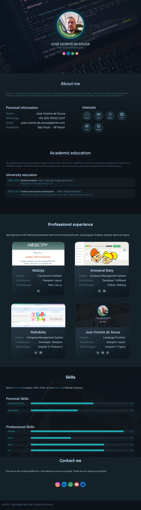

[JAVASCRIPT__BADGE]: https://img.shields.io/badge/Javascript-000?style=for-the-badge&logo=javascript
[TYPESCRIPT__BADGE]: https://img.shields.io/badge/typescript-D4FAFF?style=for-the-badge&logo=typescript
[ANGULAR__BADGE]: https://img.shields.io/badge/Angular-red?style=for-the-badge&logo=angular
[FIGMA__BADGE]: https://img.shields.io/badge/Figma-white?style=for-the-badge&logo=figma
[NETLIFY__BADGE]: https://img.shields.io/badge/Netlify-red?style=for-the-badge&logo=netlify

<h1 align="center" style="font-weight: bold;">Landing Page Portifólio/SSR </h1>

![angular][ANGULAR__BADGE]
![typescript][TYPESCRIPT__BADGE]
![javascript][JAVASCRIPT__BADGE]
![netlify][NETLIFY__BADGE]
![figma][FIGMA__BADGE]

<p align="center">
 <a href="#about">Sobre</a> • 
 <a href="#started">Primeiros Passos</a>
</p>

<p align="center">
    
</p>

<h2 id="about"> -- Sobre -- </h2>

Este repositório contém uma Landing Page 'Portifólio' construída com Angular 17 usando mecanismo SSR construído com base na live da <a href="https://github.com/Fernanda-Kipper">Fernanda-kiper</a> no youtube [Youtube Channel](https://www.youtube.com/live/O26fDEnAukY?si=8OjYdSyhlAuNUSa_).


<h2 id="started"> -- Primeiros Passos -- </h2>

Aqui você descreve como executar seu projeto localmente

<h3>Pré-requisitos</h3>

Aqui você lista todos os pré-requisitos necessários para execução do seu projeto. Por exemplo:

- [NodeJS](https://github.com/)
- [Git 2](https://github.com)

<h3>Clonando</h3>

Como clonar seu projeto

```bash
git clone https://github.com/josevsousa/landing-page-ssr.git

cd lading-page-ssr
``` 

Aqui você descreve como executar seu projeto localmente

<h3>Pré-requisitos</h3>

Aqui você lista todos os pré-requisitos necessários para execução do seu projeto. Por exemplo:

- [NodeJS](https://github.com/)
- [Git 2](https://github.com)


<h3>Inicializando</h3>

Agora você só precisa instalar as dependências e executá-lo.

```bash
npm install
npm start
```

<h3>Helpful links</h3>

- [Angular 17 Docs](https://angular.dev/)
- [Figma Layout](https://www.figma.com/design/WmBl93CrSqL0GYZQq68dv2/loading-page?node-id=0-1&t=MYfK0Q1H6AyPdEeN-1)


